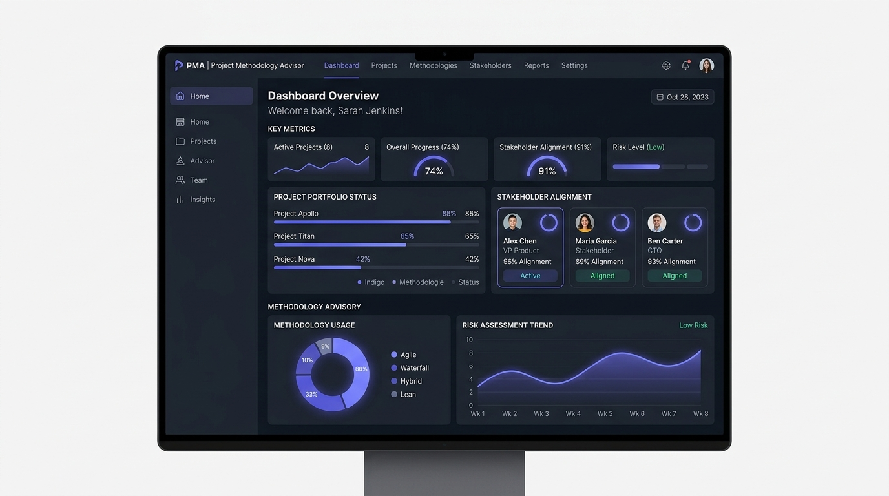
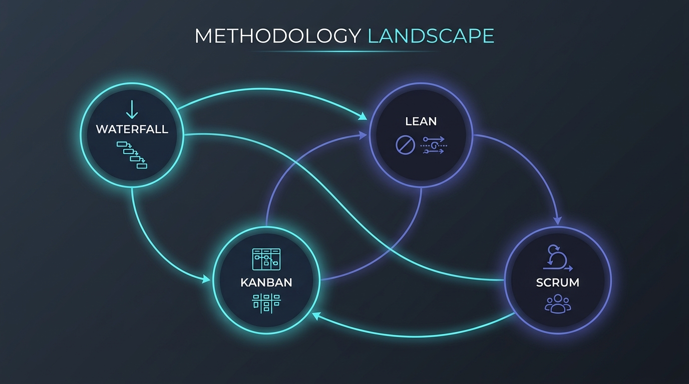

# 🎯 Project Methodology Advisor & Simulator

An interactive, multi-lens decision engine designed to help project leaders, delivery managers, and executives identify, simulate, and calibrate the optimal project management framework (Scrum, Kanban, XP, Waterfall, Hybrid, Scrumban, SAFe, or Lean) for their specific organizational environment.

Built with **React 18**, **TypeScript**, **Tailwind CSS**, and **Framer Motion**, this responsive SPA runs completely client-side, making it perfect for hosting directly on **GitHub Pages**.

---

## 🎨 Visual Preview

### Interactive Advisor Dashboard


### Methodology Landscape Mind Map


---

## 🚀 Key Features

*   **⚡ Intelligent Assessment & Adaptive Mode**: Answer an optimized, dynamic question stream that calculates real-time confidence gaps between frameworks.
*   **📂 Multi-Lens Analytical Breakdown**: View matching scores aggregated through five distinct organizational perspectives: *Product & Scope*, *Engineering Rigor*, *Stakeholders & Budgets*, *Team Dynamics*, and *Compliance & Risk*.
*   **🗺️ Interactive Mind Maps & Flowcharts**:
    *   *Decision Flow*: Track how your response history highlights dynamic paths through predictive, adaptive, and continuous-flow branches.
    *   *Landscape Mind Map*: Explore the global methodology families with an interactive inspector sidebar highlighting prerequisite roles and primary delivery metrics.
*   **🎛️ Interactive Weight Tuner**: Fine-tune stakeholder influence or department priorities on-the-fly and observe immediate updates to framework rankings.
*   **💾 Scenario Comparisons**: Save multiple assessment profiles (e.g., "Maturity Level A" vs "Urgent Client Project") to perform side-by-side gap analysis.
*   **🌍 GitHub Pages Ready**: Fully configured relative paths and single-bundle builds optimized for GitHub's static hosting environment.

---

## 🛠️ Local Development & Deployment

### 1. Requirements
*   **Node.js** (v18 or higher recommended)
*   **npm**

### 2. Getting Started
Clone or extract the project to your local directory and run:

```bash
# Install dependencies
npm install

# Start the local development server
npm run dev
```

Your browser will automatically open the app at `http://localhost:3000` (or the mapped dev port).

---

## 📦 How to Deploy to GitHub Pages

Since the app has been configured with `base: "./"` in `vite.config.ts`, all assets are referenced via relative paths. This allows seamless hosting in any GitHub repository sub-path without broken assets or blank screens.

Follow these simple steps to deploy:

### Method A: Automated Deployment via GitHub Actions (Recommended)

1. **Create the Action Workflow**: In your repository, create a file at `.github/workflows/deploy.yml`:

```yaml
name: Deploy to GitHub Pages

on:
  push:
    branches:
      - main  # Or master, depending on your default branch name

permissions:
  contents: write

jobs:
  build-and-deploy:
    runs-on: ubuntu-latest
    steps:
      - name: Checkout Repository
        uses: actions/checkout@v4

      - name: Setup Node.js
        uses: actions/setup-node@v4
        with:
          node-version: 20
          cache: 'npm'

      - name: Install Dependencies
        run: npm ci

      - name: Build Application
        run: npm run build

      - name: Deploy to GitHub Pages
        uses: JamesIves/github-pages-deploy-action@v4
        with:
          folder: dist
          branch: gh-pages
```

2. **Push to GitHub**: When you push your code to the `main` branch, the workflow will automatically compile the application and publish the static contents of the `dist` folder to the `gh-pages` branch.
3. **Enable Pages**: In your repository settings under **Settings > Pages**, set the source to deploy from the `gh-pages` branch.

### Method B: Manual Deployment via `gh-pages` NPM Package

If you prefer to deploy directly from your local terminal:

1. Install the `gh-pages` package:
   ```bash
   npm install --save-dev gh-pages
   ```
2. Add deployment scripts to your `package.json`:
   ```json
   "scripts": {
     "predeploy": "npm run build",
     "deploy": "gh-pages -d dist"
   }
   ```
3. Run the deploy command:
   ```bash
   npm run deploy
   ```

---

## 🔬 Tech Stack & Design

*   **Framework**: React 18 with TypeScript.
*   **Bundler**: Vite with lightning-fast relative-path static compiles.
*   **Styling**: Tailwind CSS utilizing deep slate typography (`Inter` & `JetBrains Mono`).
*   **Icons**: Rich visual indicators powered by `lucide-react`.
*   **Animations**: Micro-interactions, slide-ins, and step transitions configured through custom CSS classes and animations.
